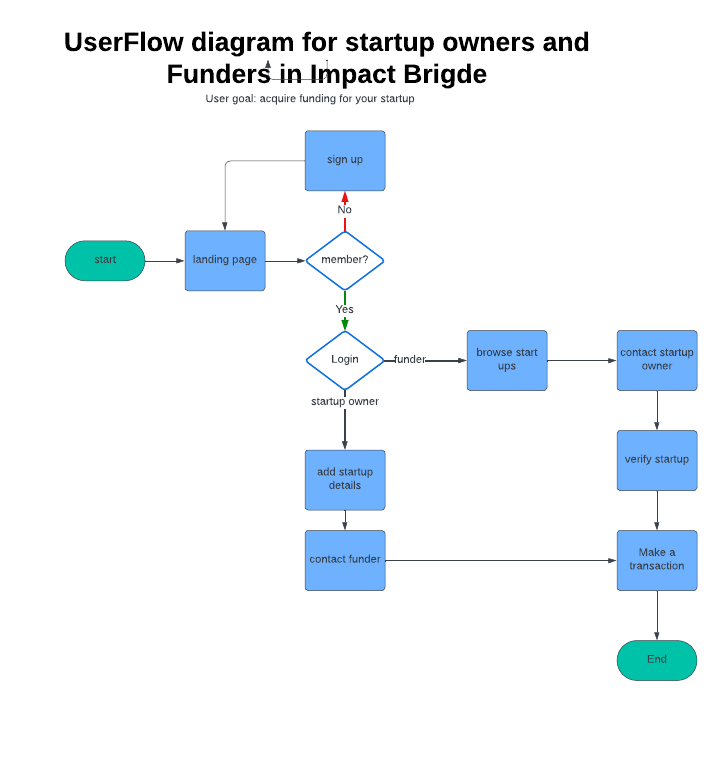

<<<<<<< HEAD
# ImpactBridge 🌉

## Connecting Local Visionaries with Global Opportunity



### 🎯 Core Concept

ImpactBridge is a dynamic platform designed to connect impact-driven businesses with a supportive ecosystem of investors, mentors, and service providers. Our mission is to transcend traditional funding marketplaces by creating an inclusive, globally interconnected support network for entrepreneurship.

### 🚀 Platform Vision

At the heart of ImpactBridge lies a simple yet powerful idea: Every local business has a global potential. We bridge the gap between community-driven ventures and worldwide opportunities by providing:

- 🤝 Direct Relationship Building
- 💡 Strategic Guidance
- 💰 Funding Pathways
- 🌍 Global Market Access

### 📦 Minimum Viable Product (MVP) Scope

Our 48-hour hackathon MVP focuses on core functionality to validate the platform's core matching concept:

#### Key Features
- 👤 User Authentication (Signup/Login)
- 🏢 Business Profile Creation
- 🔍 Investor & Mentor Directory
- 📄 Pitch Deck Upload
- 🤲 "Express Interest" Matching System

### 🛠 Technology Stack

#### Backend
- **Language**: Go (Golang)
- **Database**: PostgreSQL/SQLite
- **Authentication**: JWT

#### Frontend
- **Framework**: React
- **State Management**: Context API
- **Routing**: React Router

### 🗂 Project Structure

```
impactbridge/
├── backend/           # Go backend services
│   ├── cmd/           # Application entry points
│   ├── internal/      # Core business logic
│   └── pkg/           # Shared utilities
├── frontend/          # React application
│   ├── src/
│   │   ├── components/
│   │   ├── pages/
│   │   └── services/
└── README.md
```

### 🚦 Getting Started

#### Prerequisites
- Go 1.16+
- Node.js 14+
- PostgreSQL/SQLite

#### Installation

1. Clone the repository
```bash
git clone https://github.com/yourusername/impactbridge.git
cd impactbridge
```

2. Setup Backend
```bash
cd backend
go mod download
go run cmd/server/main.go
```

3. Setup Frontend
```bash
cd frontend
npm install
npm start
```

### 🤝 Contributing

We welcome contributions! Please see [CONTRIBUTING.md](CONTRIBUTING.md) for details on our code of conduct and the process for submitting pull requests.

### 📄 License

This project is licensed under the MIT License - see the [LICENSE.md](LICENSE.md) file for details.

### 🌟 Roadmap

- [ ] Enhance Matching Algorithm
- [ ] Implement Advanced Analytics
- [ ] Build Mobile Companion App
- [ ] Integrate More Service Providers

### 💡 Vision Statement

ImpactBridge isn't just a platform—it's a movement. We believe that by connecting local authenticity with global opportunity, we can create a more equitable, sustainable entrepreneurial ecosystem.

---

**Made with ❤️ by Impact Innovators**
=======
# Impact Bridge

A web platform connecting startups with potential investors, facilitating the funding process for innovative projects.

## Features

- User Authentication (Startup & Investor)
- Personalized Dashboards
- Startup Listings
- Investor Profiles
- Real-time Messaging (for Startups)

## Prerequisites

- Node.js (v14 or higher)
- MongoDB (v4.4 or higher)
- npm or yarn

## Installation

1. Clone the repository:
```bash
git clone https://github.com/yourusername/impact-bridge.git
cd impact-bridge
```

2. Install backend dependencies:
```bash
cd backend
npm install
```

3. Install frontend dependencies:
```bash
cd ../frontend
npm install
```

4. Create environment files:

Backend (.env in /backend):
```env
PORT=3001
MONGODB_URI=mongodb://localhost:27017/impact-bridge
JWT_SECRET=your_jwt_secret_here
```

Frontend (.env in /frontend):
```env
VITE_API_URL=http://localhost:3001
VITE_GOOGLE_CLIENT_ID=your_google_client_id_here
```

## Running the Application

1. Start MongoDB:
```bash
sudo systemctl start mongod
```

2. Start the backend server:
```bash
cd backend
npm run dev
```

3. Start the frontend development server:
```bash
cd frontend
npm run dev
```

The application will be available at `http://localhost:5173`

## Project Structure

```
impact-bridge/
├── backend/
│   ├── models/         # Database models
│   ├── routes/         # API routes
│   ├── middleware/     # Custom middleware
│   └── server.js       # Server configuration
├── frontend/
│   ├── src/
│   │   ├── components/ # React components
│   │   ├── assets/     # Static assets
│   │   └── App.jsx     # Main application component
│   └── index.html      # HTML entry point
└── README.md
```

## Dependencies

### Backend
- express
- mongoose
- jsonwebtoken
- bcryptjs
- cors
- dotenv

### Frontend
- react
- react-router-dom
- @mui/material
- axios
- @emotion/styled
>>>>>>> 9b916f859d6124eeac2bef988d96ea3b5a5456df
